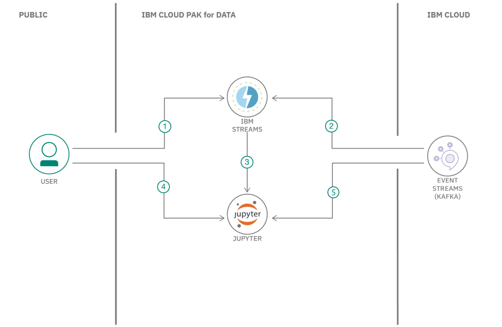
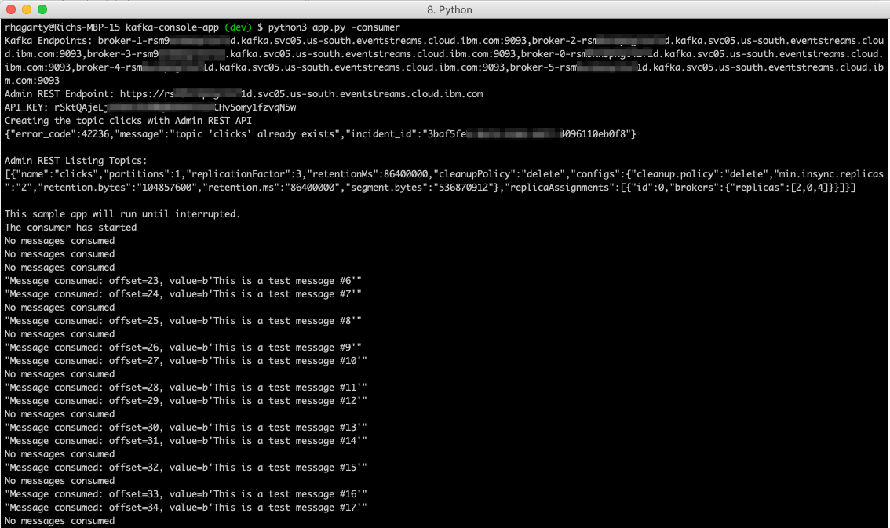
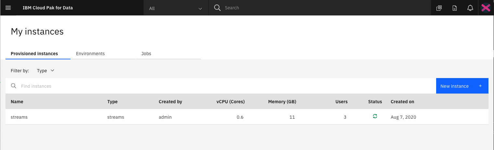

# Build a Kafka streaming application using IBM Streams

In this code pattern, we walk you through the basics of creating a streaming application powered by Apache Kafka, one of the most popular open-source distributed event-streaming platforms used for creating real-time data pipeline and streaming applications.

Our application will be built using IBM Streams on IBM Cloud Pak for Data. IBM Streams provides a built-in IDE, called **Streams flows**, that allows developers to visually create their streaming application. The Cloud Pak for Data platform provides additional support, such as integration with multiple data sources, built-in analytics, Jupyter notebooks, and machine learning.

> **NOTE**: The IBM Streams service is also available on IBM Cloud, and has the product name [IBM Streaming Analytics](https://cloud.ibm.com/catalog/services/streaming-analytics).

For our Apache Kafka service, we will be using `IBM Event Streams` on IBM Cloud, which is a high-throughput message bus built on the Kafka platform. In the following examples, we will show it as both a source and a target of clickstream data - data that was captured from user clicks as they browsed on-line shopping websites.

> **IMPORTANT**: It's easy to get the two IBM streaming services confused due to their similar names. The distinction is that **IBM Event Streams** provides the data which can then be ingested and analyzed by **IBM Streams** applications. Additionally, these applications are developed using **Streams flows**, the built-in IDE in **IBM Streams**.

## Flow



1. User creates streaming app in IBM Streams
1. Streaming app uses Kafka service via IBM Event Streams to send/recieve messages
1. Jupyter notebook is generated from IBM Streams app
1. User executes streaming app in Jupyter notebook
1. Jupyter notebook accesses Kafka service via IBM Event Stream to send/receive messages

## Incuded components

* [IBM Streams on Cloud Pak for Data](https://www.ibm.com/cloud/streaming-analytics): Development platform for visually creating streaming applications.
* [Apache Kafka](https://kafka.apache.org): Kafka is used for building real-time data pipelines and streaming apps. It is designed to be horizontally scalable, fault-tolerant and fast.
* [Event Streams](https://cloud.ibm.com/catalog/services/event-streams): A scalable, high-throughput message bus. Wire micro-services together using open protocols.
* [Jupyter Notebook](https://jupyter.org/): An open source web application that allows you to create and share documents that contain live code, equations, visualizations, and explanatory text.

## Featured technologies

* [Python](https://www.python.org/): Python is a programming language that lets you work more quickly and integrate your systems more effectively.
  > **NOTE**: Python 3 is required for this application to run locally.

## Prerequisites

* An [IBM Cloud Account](https://cloud.ibm.com)
* [IBM Cloud Pak for Data](https://www.ibm.com/in-en/products/cloud-pak-for-data)

## Steps

1. [Clone the repo](#1-clone-the-repo)
1. [Provison Event Streams on IBM Cloud](#2-provison-event-streams-on-ibm-cloud)
1. [Create sample Kafka console python app](#3-create-sample-kafka-console-python-app)
1. [Add IBM Streams service to Cloud Pak for Data](#4-add-ibm-streams-service-to-cloud-pak-for-data)
1. [Create a new project in Cloud Pak for Data](#5-create-a-new-project-in-cloud-pak-for-data)
1. [Create a Streams Flow in Cloud Pak for Data](#6-create-a-streams-flow-in-cloud-pak-for-data)
1. [Create a Streams Flow with Kafka as source](#7-create-a-streams-flow-with-kafka-as-source)
1. [Use Streams Flows option to generate a notebook](#8-use-streams-flows-option-to-generate-a-notebook)
1. [Run the generated Streams Flow notebook](#9-run-the-generated-streams-flow-notebook)

### 1. Clone the repo

```bash
git clone https://github.com/IBM/ibm-streams-with-kafka
```

### 2. Provison Event Streams on IBM Cloud

To create your IBM Event Streams service:

* From your IBM Cloud dashboard, click on `create resource`.
* Search the catalog for `streams`.
* Click the `Event Streams` tile to launch the create panel.


From the panel, enter a unique name, a region and resource group, and a plan type (select the default `lite` plan). Click `Create` to create and enable your service.

#### Launch Event Streams

From the IBM Cloud dashboard, click on your new Event Streams service in the resource list.

#### Create Event Streams topic

From the `Manage` tab panel of your Event Streams service, click `Topics`.

From the `Topics` panel, click the `Create topic +` button.


From the `Create Topics` panel, enter the name `clicks` for the topic name. Then click `Next`.


In the subsequent panels, accept the default values of 1 partition and 1 retention day.

>**NOTE**: Under the `lite` plan, you will only be able to create one topic.

#### Collect service credentials

In order to remotely connect to your new Event Streams service, you will need generate service credentials.

From the `Service credentials` tab panel, click the `New Credentials` button. The credential values we will be using include:

* **kafka_brokers_sasl**
* **kafka_http_url**
* **password**
* **user**


### 3. Create sample Kafka console python app

Your `Event Streams` service panel provides a `Getting started` panel that links to a repository of sample apps you can use to send and receive `Event Stream` messages. The sample shows how a producer sends messages to a consumer using a `topic`. The same sample program is used to consume messages and produce messages.

For convenience, the python version of the sample app is included in this repo and is located in the `/kafka-console-app` directory. The code has also been slightly modified to work better with this code pattern.

For a full list and descriptions of the available sample `Event Streams` apps, visit [https://github.com/ibm-messaging/event-streams-samples](https://github.com/ibm-messaging/event-streams-samples).

#### Building the app

To build the sample app:

```bash
cd kafka-console
pip install -r requirements.txt
cp env.sample .env
```

Edit the `.env` file in the local directory and update the values to match the credentials you created in the previous step.

>**NOTE**: Formatting of text in the `.env` file is very strict. When cutting/pasting the `kafka_brokers_sasl` values, ensure that you remove all quote marks and internal spaces. Also, you should not have to change the default `username` and `topic name` values if you followed the previous steps for setting up your `Event Streams` service.

The Kafka console app has 2 modes it can run in: `producer` or `consumer`. The mode is set using run-time arguments.

#### Running the app

To run the app, use the following command:

```bash
python3 app.py -producer
# OR
python3 app.py -consumer
```

In `producer` mode, test messages are sent to the Kafka service with the topic name set to `clicks`. Each message will be printed to the console.

In `consumer` mode, a Kafka service reader is set up to listen for message where the topic name is set to `clicks`. Each message received will be printed to the console.

To test the app, start a producer in one terminal console, and a consumer in a separate terminal console.

Here is sample output from the consumer app:



### 4. Add IBM Streams service to Cloud Pak for Data

Ensure that your administrator has added `IBM Streams` as a service to your `Cloud Pak for Data` instance, and that your user has access to the service.

Once you login to your `Cloud Pak for Data` instance, click on the (☰) `menu` icon in the top left corner of your screen and click `My Instances`.



### 5. Create a new project in Cloud Pak for Data

Once you login to your `Cloud Pak for Data` instance, click on the (☰) `menu` icon in the top left corner of your screen and click `Projects`.

From the Project list, click on `New Project`. Then select `Create an empty project`, and enter a unique name for your project. Click on `Create` to complete your project creation.


### 6. Create a Streams Flow in Cloud Pak for Data

From your `Cloud Pak for Data` project list panel, click on the project you created in the previous step.

From the project panel, click the `Add to project +` button. Choose the `Streams flow` tile from the list of options.


Provide a unique name for the flow, and select the create `Manually` option. Then click `Create` to create the flow.


Once created, it will be displayed in the `Streams flow` editor.


On the left are the operators that can drag-n-dropped onto the editor canvas. The operators are divided into type. For the purpose of this code pattern, we will only focus on `Sources` and `Targets`.

In the main icon bar at the top, you will see the options to `run` and `save` the flow.

For our first experiement, let create a flow where sample data is streamed into a Kafka operator.

#### Add sample clickstream data as data source

From the `Sources` list, select and drag the `Sample Data` operator onto the canvas.


Click on the canvas object to see its associated properties. From the list of available data types in the `Topic` drop-down list, select `Clickstream`.


If you expand the output `schema`, you can see all the attributes of the sample data.


#### Add a Kafka operator as target

From the `Targets` list, select and drag the `Kafka` operator onto the canvas.


Click on the canvas object to see its associated properties. The `Connection` property is used to tie the operator to an actual `Kafka` service.

#### Create a Kafka connection to our IBM Event Streams service

To create a connection to the Event Streams service we created in an earlier step, click the `Add Connection +` button.


Select the `Apache Kafka Streams` option.


From the pop-up dialog, provide a unique name for the connection. Then enter the `User name/Token` value. In most cases this will `token`.


All of the other fields you can leave as is, except for the `Brokers` and `Password/API key` fields. For these values, use the credentials that were described in a prevous step.

**NOTE**: The correct format must be used for both values. Use quotes around the full set of brokers, and use a comma to separate each broker. For password, do not use any quotes.


Click `Create` to complete the connection.

To ensure that the connection was successfully configured, you should see a topic list box displayed, and one of the options should be the topic `clicks`.


If `clicks` is not listed, edit the configuration to verify your field values.

#### Connect the operators and run the flow

To connect the operators, click on the right-hand circle icon located in the source opertor, and drap your mouse to the target operator. This should result in a line graph connecting the two objects.


This connection should also eliminate any errors that were previosly listed for the objects (red circle displayed in the object - clicking on this object will list the errors).

Click the `Save and run` icon to start your flow. This will result in a new panel being displayed that shows real-time metrics.


What is displayed is a live data stream. If you click on the stream between any two operator nodes, you can see the actual data - in a table view or in JSON format.


Use the `Stop` icon to stop the flow, and the `Pencil` icon to return to the flow editor.

>**NOTE**: This is a very basic IBM Stream flow. A more realistic streaming app would include additonal operators to filter and modify the stream between nodes.

#### Use the Kafka sample app to view the messages

Run the Kafka sample app in `consumer` mode to view the messages from the sample clickstream data.


### 7. Create a Streams Flow with Kafka as source

Now that we are familiar with the `Streams Flow` editor, let's create a new flow that uses `Kafka` as the source, instead of a target.

We start by adding a new `Streams Flow` to our project.


#### Add Kafka operator as source

From the `Sources` list, select and drag the `Kafka` operator onto the canvas.


From the properties menu, select the `Connection` that we created earlier. Also set `Record value parsing` to `None`.


For the `Output Schema` we will need to set the attributes to match the format of our messages. Click the `Edit` button to bring the settings dialog.


Enter the following values:


#### Add Debug operator as target

For simplicity, we will assign a `Debug` operator as the target of our Kafka stream messages.

From the `Targets` list, select and drag the `Debug` operator onto the canvas, and then connect the two object together.


#### Run the streams flow

Click the `run` button to start the flow.

You should notice that no messages are being sent. This is to be expected since the Kafka stream is empty. To solve this problem, we need to run our sample app to generate some messages.

Run the Kafka sample app in `producer` mode to send messages to our stream. The real-time metrics of our flow panel should detect that messages are now flowing.


### 8. Use Streams Flows option to generate a notebook

Once we have confirmed our `Streams flows` apps are working correctly, we can use the `Export to Notebook` feature to generate a Jupyter Notebook. The notebook will contain the python code to complete the same task - create a connection to the IBM Streams instance, create a source and target operator, then submit the job to run the stream.

From the flow editor of one of the previous created `Streams flows`, click the `Export to Notebook` icon.


### 9. Run the generated Streams Flow notebook

This action will result in a new notebook being added to your `Cloud Pak for Data` project (the name will be the same as the flow), and the notebook being displayed in edit/run mode.

> If you are not familiar with notebooks, here is some background info:
>
> When a notebook is run, each code cell in the notebook is executed, in order, from top to bottom.
>
> Each code cell is selectable and is preceded by a tag in the left margin. The tag format is displayed as `[x]:`. Depending on the state of the notebook, the x can be:
>
> * A blank, which indicates that the cell has never been run
> * A number, which represents the relative order that this code step was run
> * An *, which indicates that the cell is running
>
> There are several ways to run the code cells in your notebook:
>
> * One cell at a time. Select the cell, and then press Play in the toolbar.
> * Batch mode, in sequential order. From the Cell menu, there are several options available. For example, you can Run All cells in your notebook, or you can Run All Below, which starts running from the first cell under the currently selected cell, and then continues running all of the cells that follow.
> * At a scheduled time. Press the Schedule button that is located in the upper-right section of your notebook page. Here, you can schedule your notebook to be run once at some future time or repeatedly at your specified interval.

For our notebook, run the cells one by one, and observe how each of the operators is gererated and tied into a `Streams flow'.

>**NOTE**: For convenience, both streams notebooks are stored in this repo in the `/notebooks` directory. A version with output can be found for each in the `with-output` subdirectory.

If no errors occur, the flow is submitted to the `IBM Streams` instance. If successful, a `Job` number will printed.


This job should show up in the list of jobs associated with our `IBM Streams` instance.


Click the `View Graph` option in the action menu to see the actually messages streaming in real-time.


As noted earlier, the notebook will be added to the asset list for our `Cloud Pak for Data` project. To re-run or edit the notebook, click the `pencil` icon.


# License

This code pattern is licensed under the Apache Software License, Version 2.  Separate third party code objects invoked within this code pattern are licensed by their respective providers pursuant to their own separate licenses. Contributions are subject to the [Developer Certificate of Origin, Version 1.1 (DCO)](https://developercertificate.org/) and the [Apache Software License, Version 2](https://www.apache.org/licenses/LICENSE-2.0.txt).

[Apache Software License (ASL) FAQ](https://www.apache.org/foundation/license-faq.html#WhatDoesItMEAN)
